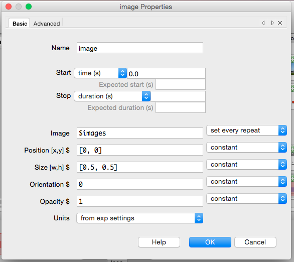
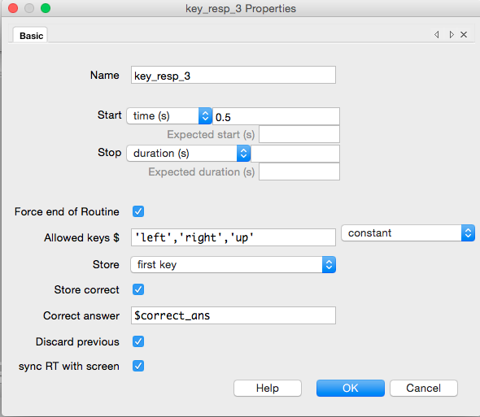
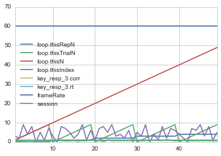
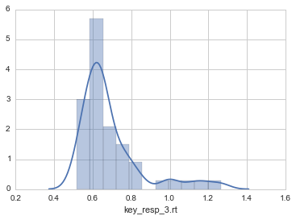
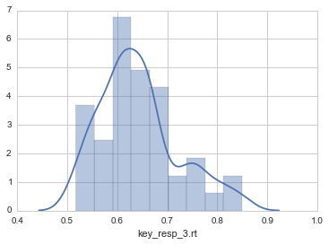
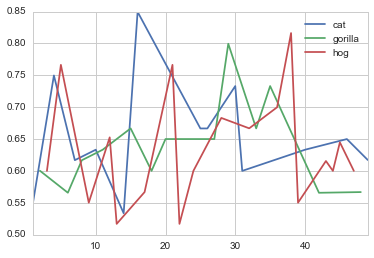
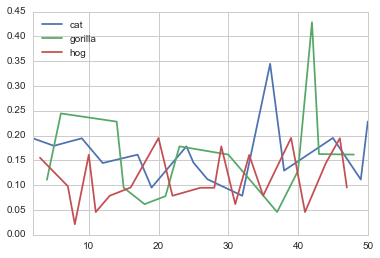

Welcome to Psychopy 101
-

Psychopy is a free software package written in the Python programming language for creating and running cognitive/psychophysics experiments.  This introductory class is aimed at beginners and does not require any programming experience.

Setting up
-

Looping through conditions
-

Now that we have our movie structure:

We can add the movie's scene components.

Click on *Stimulus* in the **Flow** to open the scene, then click  in the **Components** panel.  
A box pops up with several options for the image. Notice the default duration of an image is 1 second.

In the *Image* dialoge box, we need tell *Psychopy* where to look for this component of the scene.  
In your *Psychopy* folder, there is a subdirectory called *'images'*. This subdirectory holds images that can be used in for this scene. Lets use the cat_eyes.jpeg file. In the *Image* dialoge box, enter the path to the file like so:  

Click OK

We can test to see if this works by running the movie. Click the Run icon  on the top right of the *Psychopy* window. Enter '001' as the participant number.

In your *Psychopy* directory, you will now see a *'data'* subdirectory with the data saved in the form of 001_filename_date.csv. We will discuss the contents of the .csv later.

The movie works, but usually there are many scenes in a movie, and in psychological experiments the scene is often repeated.

In the **Flow**, click the *Insert Loop* button.
Click the first dot immediately following *Stimulus* and the second dot immediately before it. A dialog box apears with several options. Name it 'trials', the stimulus will loop 5 times by default.  
Run  the experiment again.

You will have noticed that there was only one presentation of the kitten scene, any idea why? The kitten scene was actually presented for 1 second, 5 times, but there was no gap between the scenes. 

An interstimulus interval (ISI) is required to separate each scene. In the **Components** panel, click *Custom* then the . The default ISI is 0.5 seconds. Click OK, there is now a pink shaded area for 0.5 seconds.  
Put the ISI before the image by changing the start time of the  to 0.5 and the duration to 1.0. 

Run  the movie again.

So we have 5 scene presentations, but what about recording a response? Let's add a button press for reaction time and accuracy.  
Click on the  in the **Components** panel. There are several options again, type 'space' into the *Allowed keys* box to indicate a response by spacebar press. Click OK and the key response appears in the workspace.

Click again on the  in the scene, and change the duration of the image to 0. Now the picture will be presented until the spacebar is pressed.

We now have instructions and a scene that flashes for 1 second 5 times, and we can record a response. Click 

Lets check out the data.
 
This is good, but we can also loop through different scenes. 

Let's use a new example. Imagine that *Psychopy* is in the pizza delivery business.  
*Psychopy* needs to collect the pizza order and deliver it to the customer, then receive the money. *Psychopy* looks at the list of pizzas to be delivered, and delivers each in turn until there are no more. Similarly, *Psychopy* can collect an image from a list, deliver it to the participant, and then receives a response, continuing until the list is done.

This list can be saved to an excel spreadsheet. In your *images* subdirectory, there is a file called datafile.xlsx. This contains a ready-made list.

Like the path we entered to the kitten image earlier, the column *images* has a list of paths to images.  
There are additional columns in the spreadsheet, in the pizza example, these can be thought of as the drink and a dessert that accompany the pizza. The drink and dessert in each row are specific to the pizza in that row.

Lets set it up. In this example we will use images of gorillas, kittens and hedgehogs. The instructions are:

*You will see pictures*

*Press left for gorillas*  
*Press right for kittens*  
*Press up for hedgehogs*

*Press spacebar to continue*

Click on *Instructions* in the **Flow**, and select . Type the above into the *Text* box.

To tell *Psychopy* where to look for the datafile, click on *trials* in the **Flow** and select *Browse...*. Select the datafile.xlsx and hit OK. The path to the file is now in the dialog box, and below there will be a summary of what is included. In this spreadsheet there are 10 rows (conditions) with 3 columns (parameters) as shown below.

Now, to tell *Psychopy* to deliver the images from this list, click on *Stimulus* in the **Flow**, and the . In the *Image* box, type '\$images'. The \$ tells *Psychopy* to look for the column called *images* in the excel spreadsheet. Change the associated dropdown box to *set every repeat*. The image Properties should look like this:  

Click OK.

We now need to record the amount of money received following pizza delivery, or the button press recieved following the image delivery. Click the  and type ' 'left', 'right', 'up' ' into *Allowed keys*. In the *Store* dropdown, select *first key*. Finally, click the box to *Store correct* and enter '\$correct_ ans' in the *Correct answer* box. As with the image properties, this tells *PsychoPy* to look in the correct_ans column in the excel spreadsheet. Your Properties should resemble the image below.

Your scene should now look like this:

Let's do it! Click 

Using the Pandas library to explore the data
-

**Learning objectives:**

- Use shell commands to navigate to the data folder
- Import Psychopy data into the Jupyter Notebook
- Generate descriptive statistics
- Plot some comparisons by grouping data 

We will set up the notebook and load the additional software library we will need  - "Pandas".

    import pandas as pd

The Jupyter Notebook understands shell commands as well, we'll use this to find our data. We'll use the exclamation mark to signal that what follows is a shell command rather than Python code.

    # print working directory 
    !pwd

    /Users/talithaford/Dropbox/Conference-Workshop/ResBaz/2016/psychopy_lesson

    # list files in 'data/'
    !ls data/

    tf1_visneuro_2016_Feb_02_1234.csv    tf_visneuro_2016_Feb_02_1218.psydat
    tf1_visneuro_2016_Feb_02_1234.log    tf_visneuro_2016_Feb_02_1233.csv
    tf1_visneuro_2016_Feb_02_1234.psydat tf_visneuro_2016_Feb_02_1233.log
    tf_visneuro_2016_Feb_02_1218.csv     tf_visneuro_2016_Feb_02_1233.psydat
    tf_visneuro_2016_Feb_02_1218.log

We can use the 'read_csv' function of Pandas to read the datafile into a pandas DataFrame. A DataFrame will look familiar to anyone who has used Excel or SPSS.

    # read the csv
    df = pd.read_csv('data/tf1_visneuro_2016_Feb_02_1234.csv')
    # print the first 5 lines of the DataFrame
    df.head()

<table border="1" class="dataframe">
  <thead>
    <tr style="text-align: right;">
      <th></th>
      <th>correct_ans</th>
      <th>images</th>
      <th>type_of_image</th>
      <th>loop.thisRepN</th>
      <th>loop.thisTrialN</th>
      <th>loop.thisN</th>
      <th>loop.thisIndex</th>
      <th>key_resp_3.keys</th>
      <th>key_resp_3.corr</th>
      <th>key_resp_3.rt</th>
      <th>date</th>
      <th>frameRate</th>
      <th>expName</th>
      <th>session</th>
      <th>participant</th>
      <th>Unnamed: 15</th>
    </tr>
  </thead>
  <tbody>
    <tr>
      <th>0</th>
      <td>up</td>
      <td>images/egg_hog.jpeg</td>
      <td>hog</td>
      <td>0</td>
      <td>0</td>
      <td>0</td>
      <td>6</td>
      <td>up</td>
      <td>1</td>
      <td>0.633549</td>
      <td>2016_Feb_02_1234</td>
      <td>60.205465</td>
      <td>visneuro</td>
      <td>1</td>
      <td>tf1</td>
      <td>NaN</td>
    </tr>
    <tr>
      <th>1</th>
      <td>right</td>
      <td>images/cat_eyes.jpeg</td>
      <td>cat</td>
      <td>0</td>
      <td>1</td>
      <td>1</td>
      <td>3</td>
      <td>right</td>
      <td>1</td>
      <td>0.550386</td>
      <td>2016_Feb_02_1234</td>
      <td>60.205465</td>
      <td>visneuro</td>
      <td>1</td>
      <td>tf1</td>
      <td>NaN</td>
    </tr>
    <tr>
      <th>2</th>
      <td>left</td>
      <td>images/gorilla_tongue.jpeg</td>
      <td>gorilla</td>
      <td>0</td>
      <td>2</td>
      <td>2</td>
      <td>2</td>
      <td>left</td>
      <td>1</td>
      <td>0.600392</td>
      <td>2016_Feb_02_1234</td>
      <td>60.205465</td>
      <td>visneuro</td>
      <td>1</td>
      <td>tf1</td>
      <td>NaN</td>
    </tr>
    <tr>
      <th>3</th>
      <td>up</td>
      <td>images/santa_hog.jpeg</td>
      <td>hog</td>
      <td>0</td>
      <td>3</td>
      <td>3</td>
      <td>9</td>
      <td>up</td>
      <td>1</td>
      <td>0.600248</td>
      <td>2016_Feb_02_1234</td>
      <td>60.205465</td>
      <td>visneuro</td>
      <td>1</td>
      <td>tf1</td>
      <td>NaN</td>
    </tr>
    <tr>
      <th>4</th>
      <td>right</td>
      <td>images/ear_muffs_cat.jpeg</td>
      <td>cat</td>
      <td>0</td>
      <td>4</td>
      <td>4</td>
      <td>4</td>
      <td>right</td>
      <td>1</td>
      <td>0.749853</td>
      <td>2016_Feb_02_1234</td>
      <td>60.205465</td>
      <td>visneuro</td>
      <td>1</td>
      <td>tf1</td>
      <td>NaN</td>
    </tr>
  </tbody>
</table>

    # drop the first row (under the header)
    # the inplace option allows us to makes changes to the dataframe directly 
    # rather than having to save the output to another variable
    df.drop(0, inplace=True)
    df.head()

<table border="1" class="dataframe">
  <thead>
    <tr style="text-align: right;">
      <th></th>
      <th>correct_ans</th>
      <th>images</th>
      <th>type_of_image</th>
      <th>loop.thisRepN</th>
      <th>loop.thisTrialN</th>
      <th>loop.thisN</th>
      <th>loop.thisIndex</th>
      <th>key_resp_3.keys</th>
      <th>key_resp_3.corr</th>
      <th>key_resp_3.rt</th>
      <th>date</th>
      <th>frameRate</th>
      <th>expName</th>
      <th>session</th>
      <th>participant</th>
      <th>Unnamed: 15</th>
    </tr>
  </thead>
  <tbody>
    <tr>
      <th>1</th>
      <td>right</td>
      <td>images/cat_eyes.jpeg</td>
      <td>cat</td>
      <td>0</td>
      <td>1</td>
      <td>1</td>
      <td>3</td>
      <td>right</td>
      <td>1</td>
      <td>0.550386</td>
      <td>2016_Feb_02_1234</td>
      <td>60.205465</td>
      <td>visneuro</td>
      <td>1</td>
      <td>tf1</td>
      <td>NaN</td>
    </tr>
    <tr>
      <th>2</th>
      <td>left</td>
      <td>images/gorilla_tongue.jpeg</td>
      <td>gorilla</td>
      <td>0</td>
      <td>2</td>
      <td>2</td>
      <td>2</td>
      <td>left</td>
      <td>1</td>
      <td>0.600392</td>
      <td>2016_Feb_02_1234</td>
      <td>60.205465</td>
      <td>visneuro</td>
      <td>1</td>
      <td>tf1</td>
      <td>NaN</td>
    </tr>
    <tr>
      <th>3</th>
      <td>up</td>
      <td>images/santa_hog.jpeg</td>
      <td>hog</td>
      <td>0</td>
      <td>3</td>
      <td>3</td>
      <td>9</td>
      <td>up</td>
      <td>1</td>
      <td>0.600248</td>
      <td>2016_Feb_02_1234</td>
      <td>60.205465</td>
      <td>visneuro</td>
      <td>1</td>
      <td>tf1</td>
      <td>NaN</td>
    </tr>
    <tr>
      <th>4</th>
      <td>right</td>
      <td>images/ear_muffs_cat.jpeg</td>
      <td>cat</td>
      <td>0</td>
      <td>4</td>
      <td>4</td>
      <td>4</td>
      <td>right</td>
      <td>1</td>
      <td>0.749853</td>
      <td>2016_Feb_02_1234</td>
      <td>60.205465</td>
      <td>visneuro</td>
      <td>1</td>
      <td>tf1</td>
      <td>NaN</td>
    </tr>
    <tr>
      <th>5</th>
      <td>up</td>
      <td>images/marshmallow_hog.jpeg</td>
      <td>hog</td>
      <td>0</td>
      <td>5</td>
      <td>5</td>
      <td>8</td>
      <td>up</td>
      <td>1</td>
      <td>0.766511</td>
      <td>2016_Feb_02_1234</td>
      <td>60.205465</td>
      <td>visneuro</td>
      <td>1</td>
      <td>tf1</td>
      <td>NaN</td>
    </tr>
  </tbody>
</table>

    # drop all colums with NA's
    df.dropna(axis=1, inplace=True, how='all')
    df.head()

<table border="1" class="dataframe">
  <thead>
    <tr style="text-align: right;">
      <th></th>
      <th>correct_ans</th>
      <th>images</th>
      <th>type_of_image</th>
      <th>loop.thisRepN</th>
      <th>loop.thisTrialN</th>
      <th>loop.thisN</th>
      <th>loop.thisIndex</th>
      <th>key_resp_3.keys</th>
      <th>key_resp_3.corr</th>
      <th>key_resp_3.rt</th>
      <th>date</th>
      <th>frameRate</th>
      <th>expName</th>
      <th>session</th>
      <th>participant</th>
    </tr>
  </thead>
  <tbody>
    <tr>
      <th>1</th>
      <td>right</td>
      <td>images/cat_eyes.jpeg</td>
      <td>cat</td>
      <td>0</td>
      <td>1</td>
      <td>1</td>
      <td>3</td>
      <td>right</td>
      <td>1</td>
      <td>0.550386</td>
      <td>2016_Feb_02_1234</td>
      <td>60.205465</td>
      <td>visneuro</td>
      <td>1</td>
      <td>tf1</td>
    </tr>
    <tr>
      <th>2</th>
      <td>left</td>
      <td>images/gorilla_tongue.jpeg</td>
      <td>gorilla</td>
      <td>0</td>
      <td>2</td>
      <td>2</td>
      <td>2</td>
      <td>left</td>
      <td>1</td>
      <td>0.600392</td>
      <td>2016_Feb_02_1234</td>
      <td>60.205465</td>
      <td>visneuro</td>
      <td>1</td>
      <td>tf1</td>
    </tr>
    <tr>
      <th>3</th>
      <td>up</td>
      <td>images/santa_hog.jpeg</td>
      <td>hog</td>
      <td>0</td>
      <td>3</td>
      <td>3</td>
      <td>9</td>
      <td>up</td>
      <td>1</td>
      <td>0.600248</td>
      <td>2016_Feb_02_1234</td>
      <td>60.205465</td>
      <td>visneuro</td>
      <td>1</td>
      <td>tf1</td>
    </tr>
    <tr>
      <th>4</th>
      <td>right</td>
      <td>images/ear_muffs_cat.jpeg</td>
      <td>cat</td>
      <td>0</td>
      <td>4</td>
      <td>4</td>
      <td>4</td>
      <td>right</td>
      <td>1</td>
      <td>0.749853</td>
      <td>2016_Feb_02_1234</td>
      <td>60.205465</td>
      <td>visneuro</td>
      <td>1</td>
      <td>tf1</td>
    </tr>
    <tr>
      <th>5</th>
      <td>up</td>
      <td>images/marshmallow_hog.jpeg</td>
      <td>hog</td>
      <td>0</td>
      <td>5</td>
      <td>5</td>
      <td>8</td>
      <td>up</td>
      <td>1</td>
      <td>0.766511</td>
      <td>2016_Feb_02_1234</td>
      <td>60.205465</td>
      <td>visneuro</td>
      <td>1</td>
      <td>tf1</td>
    </tr>
  </tbody>
</table>

    # save out new dataframe as csv
    df.to_csv('data/ID001.csv', index=False)
    
    # to read back in you can use:
    #df = pd.read_csv('data/ID001.csv')

Visualising the data
-

**Now that we have cleaned the data, it might be helpful to visualise it.  
To do this we need to import some packages. **

**Matplotlib** is a Python library that produces quality figures and graphs from data.  
**Seaborn** is a Python library based on matplotlib, which provides additional graphical modifications for matplotlib figures and graphs.

    import matplotlib as mpl
    import matplotlib.pyplot as plt
    import seaborn as sns # seaborn 
    
    # to see the plots in the workspace we use:
    %matplotlib inline
    
    # these are seaborn commands, they are used for asthetics
    sns.set_color_codes()
    sns.set_style('whitegrid')

Create a basic plot of all the columns

    df.plot()

    <matplotlib.axes._subplots.AxesSubplot at 0x109768b50>

The plot is good, but it doesn't actually tell us much.  
Let's used the package matplotlib.pyplot ('plt'), but first, find out what the function 'plot' in the package does.

    plt.plot?

To plot a single column (e.g. reaction time), enter the name of the column (the header) as a **string** in square brackets immediately following the dataframe label as shown below. The column header is the 'index' for that column. In this example, the plot will include the legend.

    df['key_resp_3.rt'].plot(legend=True)

    <matplotlib.axes._subplots.AxesSubplot at 0x109d68cd0>

Seaborn (sns) has a nice distribution plot to visualise whether the responses are normally disributed.

    sns.distplot(df['key_resp_3.rt'])

    <matplotlib.axes._subplots.AxesSubplot at 0x109d9de10>

It is clear from the graphs that the first answer is much longer than the rest of the answers. This is more likely due to it being the first response and therefore it isn't real data. We should filter it out so it doesn't overly affect the result.

    df_clean = df[df['key_resp_3.rt'] < .9]

    sns.distplot(df_clean['key_resp_3.rt'])

    <matplotlib.axes._subplots.AxesSubplot at 0x109e5f650>

It's still not looking particularly normal but better. Maybe less than 0.3 would be better still...  

We can plot the reaction time by the type of image by including the column name 'type_of_image' in parentheses before the index.

    df_clean.groupby('type_of_image')['key_resp_3.rt'].plot(legend=True)

    type_of_image
    cat        Axes(0.125,0.125;0.775x0.775)
    gorilla    Axes(0.125,0.125;0.775x0.775)
    hog        Axes(0.125,0.125;0.775x0.775)
    Name: key_resp_3.rt, dtype: object

Creating a variable that groups reation time by the animal type gives some more functionality

    animal_type_group = df_clean.groupby('type_of_image')['key_resp_3.rt']

    # then we can plot that variable
    animal_type_group.plot(legend = True)

    type_of_image
    cat        Axes(0.125,0.125;0.775x0.775)
    gorilla    Axes(0.125,0.125;0.775x0.775)
    hog        Axes(0.125,0.125;0.775x0.775)
    Name: key_resp_4.rt, dtype: object

This doesn't tell us much, but we can now print out the statistics for that variable.

    animal_type_group.mean()

    type_of_image
    cat        0.653995
    gorilla    0.639744
    hog        0.634237
    Name: key_resp_3.rt, dtype: float64

    print('Mean: ',animal_type_group.mean())
    print('SD: ',animal_type_group.std())

    ('Mean: ', type_of_image
    cat        0.653995
    gorilla    0.639744
    hog        0.634237
    Name: key_resp_3.rt, dtype: float64)
    ('SD: ', type_of_image
    cat        0.084515
    gorilla    0.068218
    hog        0.086569
    Name: key_resp_3.rt, dtype: float64)

We can also visualise the reaction time by the type of image as a boxplot

    df_clean.boxplot('key_resp_3.rt',by = 'type_of_image',)

    <matplotlib.axes._subplots.AxesSubplot at 0x10a165690>

and save plot to the current working directory

    plt.savefig('ID001_boxplot.png')

    <matplotlib.figure.Figure at 0x10a87a390>
