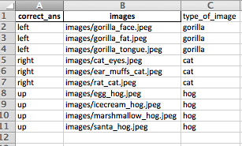
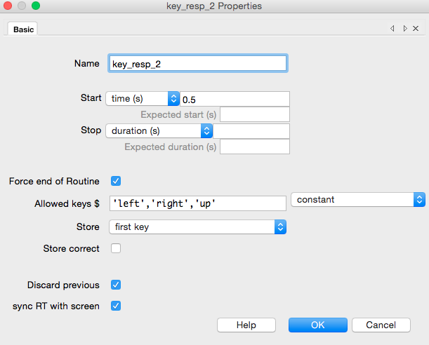

# Looping through conditions

Now that we have our movie framework:

We can go on to add the components to the sceens of the movie.

Click on *Stimulus* in the *Flow*, and click on the  in the *Components* panel. 
There are several options for an image in the sceen. The default duration of an image is 1sec.

In the *Psychopy* on your desktop, there is a subdirectory called *'images'*. The *images* directory holds the images for this sceen.

In the *Image* dialoge box, we need tell *Psychopy* where to look for the image, or in our movie example, wat sceen to display.  
Lets use the cat_eyes.jpeg file. Enter the path to the file like so:  

We can test to see if this works by running the movie. Click OK and then the Run icon 

In the *Psychopy* directory, you will now see a *'data'* directory, with the responses saved in a .csv. We will discuss the contents of the .csv later.

This movie works fine, but in psychology, a sceen is often presented many times. So, what if we want multiple sceens?

In the *Flow*, click the *Insert Loop* button.
Click the first dot just after the *Stimulus* and the second dot just before it. Again, a dialog box apears with several options. The default loop is 5 repetitions.  
Run the experiment again, click 

It appears there was only one presentation of the kitten sceen, but actually, the kitten sceen was presented for 1 second, 5 times. An interstimulus interval (ISI) is required to separate each repetition of the sceen.

In the *Components* panel, click *Custom* then the ISI component called *Static Properties*. The default ISI is 0.5. Click OK and you will see a pink shaded area for 0.5.  
Put the ISI before the sceen image, so change the start time of the  to 0.5 and the duration to 1.0. 

Run the movie again, click 

So we have a sceen, but what about a response? Let's add a button press for reaction time and accuracy.
Click on the  in the *Components* panel. There are several options again, type 'space' into the *Allowed keys* box to indicate a response by spacebar press.

Click again on the  in the sceen, and change the duration of the image to 0. Now the picture will be presented until the spacebar is pressed. 

The icon now appears in the workspace.

We now have instructions and a sceen that flashes for 1 second 5 times, and we can record a response.  
Often in behavioural neuroscience and psychology we are interested in the difference between different types of sceens.

In *Psychopy* we can add different stimuli to the loop. Lets imagine that *Psychopy* is pizza delivery person.  
*Psychopy* needs to collect the pizza and deliver it to the customer, then receive the money. *Psychopy* looks at a list of pizza's that need delivering, and will deliver each in turn until they are all done. In this way, *Psychopy* collects an image, delivers it to the participant, and then receives a response, and continues until it is done.

The list of images can be saved to an excel spreadsheet. In the *images* subdirectory, there is a file called datafile.xlsx.

The list of images that *Psychopy* selects from has the heading *images*.  
There are additional columns in the spreadsheet, these can be thought of as a drink and a dessert to accompany the pizza. The drink and dessert in each row are specific to the pizza also on that row.

Lets set it up. In this example we will use images of gorillas, kittens and hedgehogs. The instructions are:

*You will see pictures*

*Press left for gorillas*  
*Press right for kittens*  
*Press up for hedgehogs*

*Press spacebar to continue*

Click on the  icon in *Instructions* and type the above into the *Text* box.

To tell Psychopy where to look for the datafile, click on the loop icon in the *Flow* and click *Browse...*. Select the file and hit OK. Below the path, there should be a summary of what is included. Here, we have 10 rows (conditions) with 3 columns (parameters).

Now, to tell *Psychopy* to look at this list for the delivery of the images in each repetition of the sceen, click on *Stimulus* in the *Flow*, and the . In the *Image* box, type '$images'. The $ tells *Psychopy* to look for the column called *images* in the excel datafile. Change the associated dropdown box to *set every repeat*. The image Properties should look like this:  

Click OK.

We now need to record the amount of money received following pizza delivery. Click the  and type ' 'left', 'right', 'up' ' into *Allowed keys*. In the *Store* drop-down, select *first key*, and *Start* to 0.5.

Your sceen should look like this:

Let's do it! Click 

# Data time!

